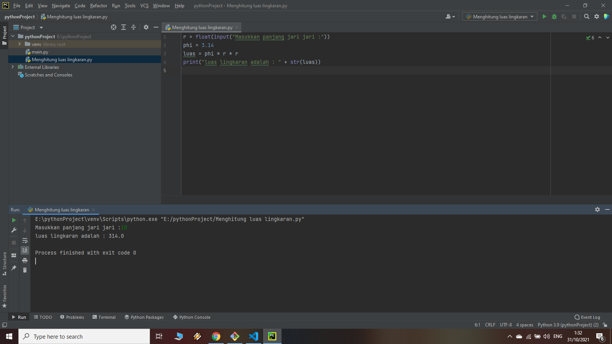

# Luas-Lingkaran
## Menghitung Luas Lingkaran

Rumus menghitung luas Lingkaran adalah Apabila panjang jari-jari lingkaran diketahui,maka luas lingkaran dapat ditentukan dengan rumus L= phi X r kuadrat dan dikalikan dengan konstanta phi.
ini adalah tampilan nya
